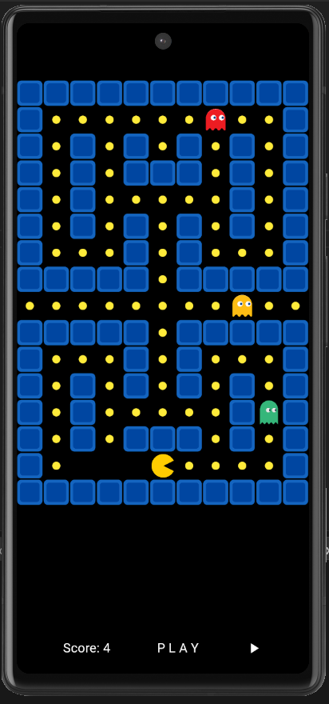

# Pac-Man Flutter 🎮👻

[](https://flutter.dev)
[](https://dart.dev)

A modern implementation of the classic Pac-Man game built with Flutter. Navigate through the maze, collect food, and avoid ghosts in this responsive mobile adaptation of the arcade classic.



## Features 🚀

- **Classic Pac-Man gameplay mechanics**
- Dynamic maze layout with barriers
- Three unique ghost enemies with different behaviors
- Food collection system with score tracking
- Gesture-based controls (swipe to move)
- Game over detection and restart functionality
- Pause/Resume game state
- Responsive UI that works on multiple screen sizes
- Clean and modern visual design

## Installation 📲

1. **Prerequisites**
   - Flutter SDK (latest stable version)
   - Dart SDK (>=2.17.0 <3.0.0)
   - Android Studio/VSCode with Flutter extension

2. **Clone the repository**
   ```bash
   git clone https://github.com/NadaAlaa1/pacman.git
   cd pacman-flutter

3. **Install dependencies**
   ```bash
   flutter pub get
   
4. **Run the app**
   ```bash
   flutter run

## How to Play 🕹️
- **Swipe** in any direction to move Pac-Man

- Collect **yellow food dots** to increase your score

- Avoid the **colored ghosts** that patrol the maze

- **Pause/Resume** using the pause button

- **Restart** the game after Game Over
